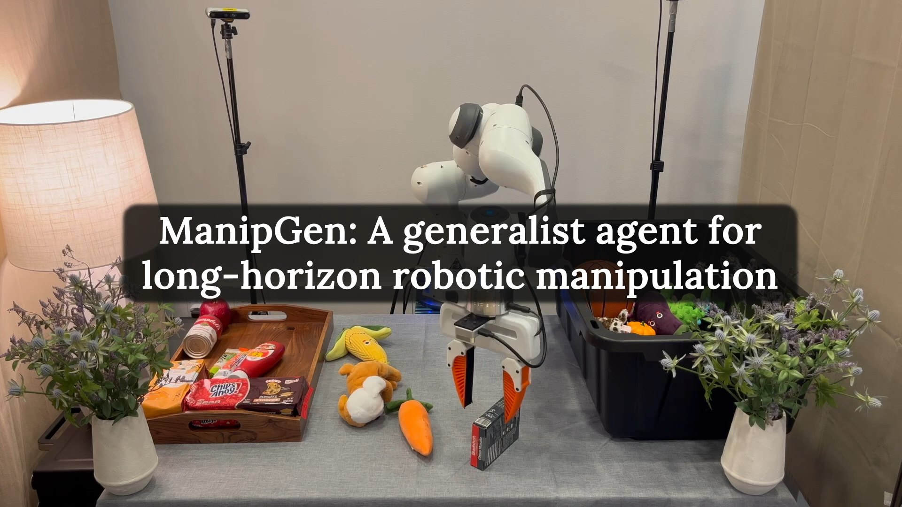

# ManipGen: A Text-conditioned Generalist Agent for Long-horizon Manipulation

This repository is the official implementation of **Local Policies Enable Zero-shot Long-Horizon Manipulation**.

<p align="center">
  
</p>

ManipGen is a generalist agent for long-horizon robotic manipulation. It leverages a new class of policies for sim2real transfer: local policies. Locality enables a variety of appealing properties including invariances to absolute robot and object pose, skill ordering, and global scene configuration. We combine these policies with foundation models for vision, language and motion planning to solve a wide range of long-horizon manipulation tasks in the real world *zero-shot*. This repository contains the implementation of ManipGen, including the code for training local policies in simulation and deploying the system in the real world.

**Authors**: [Murtaza Dalal*](https://mihdalal.github.io/), [Min Liu*](https://damianliumin.github.io/), [Walter Talbott](https://www.linkedin.com/in/walter-talbott-678b8aa8/), [Chen Chen](https://www.linkedin.com/in/chen90/), [Deepak Pathak](https://www.cs.cmu.edu/~dpathak/), [Jian Zhang](https://www.linkedin.com/in/jianzhangpurdue/), [Ruslan Salakhutdinov](https://www.cs.cmu.edu/~rsalakhu/)  
**Website**: [https://mihdalal.github.io/manipgen/](https://mihdalal.github.io/manipgen/)  
**Paper**: [https://mihdalal.github.io/manipgen/resources/paper.pdf](https://mihdalal.github.io/manipgen/resources/paper.pdf)  
**Models**: [https://huggingface.co/minliu01/ManipGen](https://huggingface.co/minliu01/ManipGen)  


If you find this codebase useful in your research, please consider citing our paper:
```bibtex
@article{dalal2024manipgen,
    title={Local Policies Enable Zero-shot Long-horizon Manipulation},
    author={Murtaza Dalal and Min Liu and Walter Talbott and Chen Chen and Deepak Pathak and Jian Zhang and Ruslan Salakhutdinov},
    journal = {International Conference on Robotics and Automation},
    year={2025},
} 
```

## Table of Contents
- [Policy Learning in Simulation](#policy-learning-in-simulation)
    - [Installation](#installation)
    - [Datasets](#datasets)
    - [RL Policies](#rl-policies)
    - [DAgger Distillation](#dagger-distillation)
- [Real World Deployment](#real-world-deployment)
    - [Hardware Setup](#hardware-setup)
    - [Environment Setup](#environment-setup)
    - [Camera Calibration](#camera-calibration)
    - [Run ManipGen](#run-manipgen)
    - [Tips for Real World Deployment](#tips-for-real-world-deployment)

## Policy Learning in Simulation
This section describes how to train policies in simulation. It is estimated to take less than a week to train these policies with **300 A100 GPUs**. If you want to directly use our pre-trained policies for real-world deployment, please skip to the [Real World Deployment](#real-world-deployment) section.

### Installation
Download IsaacGym from the [website](https://developer.nvidia.com/isaac-gym), and follow the installation instructions in the documentation. We highly recommend using a conda environment to simplify set up.

Then setup ManipGen environment:
```
git clone --recurse-submodules git@github.com:mihdalal/manipgen.git
cd manipgen
git lfs install
git lfs track "*.plugin"
pip install -e IsaacGymEnvs
pip install -e rl_games
pip install -e manipgen_robomimic/
pip install -e . # install manipgen
pip install -r requirements.txt
```

#### Multi-GPU Rendering:
We find that IsaacGym rendering works only on the first GPU when multiple GPUs are available. If you encounter the same issue, please follow the instructions below to rendering with other GPUs. This might take a few megabytes of memory on gpu 0 due to OpenGL but the actual isaacgym rendering takes effect on the selected vulkan device. 

Feel free to create a Github issue if you have better solutions.

- Setup the vulkan device chooser layer from [here](https://github.com/aejsmith/vkdevicechooser). If during installation `meson compile -C builddir` command does not work, use `ninja -C builddir` instead.

- Set the following environment variables either in .bashrc or in command line prior to the training command:
	 * `VK_ICD_FILENAMES=/etc/vulkan/icd.d/nvidia_icd.json`
	 (Verify if this file is located in `/usr/share/vulkan/icd.d/nvidia_icd.json` or the above path. If it is present in both locations, delete the `/usr/share/vulkan/icd.d/` directory.)
	 * `DISABLE_LAYER_NV_OPTIMUS_1=1`
	 * `DISABLE_LAYER_AMD_SWITCHABLE_GRAPHICS_1=1`
- run the following in your terminal:
	 * `unset DISPLAY`
	 * `sudo /usr/bin/X :1 &` (launch a virtual display)
	 * For training on gpu X, use command:	   `DISPLAY=:1 ENABLE_DEVICE_CHOOSER_LAYER=1 VULKAN_DEVICE_INDEX=X CUDA_VISIBLE_DEVICES=X python dagger.py device='cuda:X' [other arguments]`

### Datasets
ManipGen covers five skills. We train **pick**, **place** for non-articulated objects, and **grasp handle**, **open**, **close** for articulated objects. In this section we describe how to process the datasets.

You can download the processed datasets from Hugging Face by running `bash scripts/download_datasets.sh`. The datasets will be saved under `assets/`.

#### ManipGen-UniDexGrasp
We process the [UniDexGrasp](https://pku-epic.github.io/UniDexGrasp/) dataset with the following steps:
1. Augment the object size: We add smaller versions of the objects to the dataset.
2. Augment rest poses: The rest object poses in the original dataset are obtained by dropping the object from a height. We add some common rest poses which are less likely to be sampled in the original dataset (e.g., a standing bottle).
3. Sample grasp pose: We sample grasp poses for each object using antipodal sampling. Then we teleport the gripper to grasp the object from the sampled poses, add perturbations, and record valid grasp poses. The ratio of valid grasp pose is also used to filter intractable rest poses (e.g., an upside-down bowl).

We provide the script for step 3 in [scripts/generate_grasp_pose_dataset.py](manipgen/scripts/generate_grasp_pose_dataset.py). You can run the script with the following command:
```bash
python scripts/generate_grasp_pose_dataset.py --object_file FILE
# `FILE` should contain a list of (object_scale, object_code).
```

Each object is specified by an `object_code` and `object_scale`. We provide the object list in `assets/unidexgrasp/trainset3419.txt`.

#### ManipGen-PartNet
We sample 1K+ handles from [PartNet](https://partnet.cs.stanford.edu/) and assemble them with procedually generated cabinet bodies to create the articulated objects, which cover drawers and doors. Then we sample grasp poses for each object following the same procedure as ManipGen-UniDexGrasp. The script for sampling grasp poses is [scripts/generate_grasp_pose_dataset_articulated.py](manipgen/scripts/generate_grasp_pose_dataset_articulated.py).

Each object is specified by an `object_code`. We provide the object list in `assets/partnet/trainset2655.txt`.

### RL Policies

We train RL policies for each object and each task with two steps:
1. **Sample initial states**: We sample initial states where the end effector is close to the object. We also add some constraints to ensure the object is visible from the wrist camera. Results are saved under `init_states/`.
2. **Train RL policy**: We train state-based RL policies using PPO.

Note that **sampling initial states** requires ordering of the skills. For pick and grasp handle, we sample end effector poses around the object and get franka arm poses from IK. For place, open, and close, we initialize the scene with initial states from the previous skills, execute the corresponding skill, and apply random perturbations. Therefore, we need the initial states and policy checkpoint for **pick** before sampling initial states for **place**. Similarly, **grasp handle** should be trained before **open** and **close**.

We provide example scripts for each skill below. You can modify the scripts to train policies for other objects.

#### Skill 1: Pick
```bash
# step 1: sample initial states
python sample_init_states.py task=pick num_samples=1800000 \
    object_code=core/bottle-c13219fac28e722edd6a2f6a8ecad52d object_scale=0.10

# step 2: train policy
python train.py task=pick \
    object_code=core/bottle-c13219fac28e722edd6a2f6a8ecad52d object_scale=0.10 \
    train_dir=runs/pick_demo exp_name=franka_pick_core-bottle-c13219fac28e722edd6a2f6a8ecad52d_010 \
    init_states=init_states/franka_pick_core-bottle-c13219fac28e722edd6a2f6a8ecad52d_010_init_states.pt
```
You can add the following options to the training command:
* `device=cuda:0`: specify the GPU device
* `wandb_activate=True`: run [Wandb](https://wandb.ai/site/)
* `wandb_project=pick`: specify the Wandb project name - if not specified, set to the task name automatically
* `capture_video=True`: save out videos of the first `capture_envs` environments every `capture_interval` steps and upload to Wandb for visualization
* `capture_envs=8`: number of environments to capture videos
* `capture_interval=1920`: capture videos every `capture_interval` steps, recommended to set to multiple of the episode length

There are some options specific to pick and place which configure the clutters and obstacles on the table. You do not need to modify any of them but it is good to know what they are:
* `enable_clutter_and_obstacle=True`: include clutter and obstacles in the scene
* `use_unidexgrasp_clutter=False`: if False, use capsules as clutters, otherwise use unidexgrasp clutters. We set it False for RL. For multitask DAgger it is automatically set to True.
* `unidexgrasp_file_list=assets/unidexgrasp/trainset3479.txt`: which unidexgrasp objects to sample clutters from

Note that the success rate reported during training is lower than expected as the initial states include some hard cases which are not likely to happen in the real world. We provide a standalone script to test the policy below, which filter out some of the hard cases. 
```bash
python test_policy.py task=pick checkpoint=PATH_TO_CHECKPOINT
```
Other important options for testing:
* `num_iterations=5`: number of iterations to run the test
* `num_steps=120`: number of steps per iteration - default value is the episode length of the task
* `num_envs=1024`: set the number of envrionments
* `render=True`: open IsaacGym viewer

#### Skill 2: Place
Note that sampling initial states for place requires initial states and policy checkpoint from pick. We provide the scripts below:
```bash
# step 1: sample initial states
python sample_init_states.py task=place num_samples=1200000 num_envs=4096 filter=True \
    object_code=core/bottle-c13219fac28e722edd6a2f6a8ecad52d object_scale=0.10 \
    task.sampler.policy_init_states_path=init_states/franka_pick_core-bottle-c13219fac28e722edd6a2f6a8ecad52d_010_init_states.pt \
    checkpoint=runs/pick_demo/franka_pick_core-bottle-c13219fac28e722edd6a2f6a8ecad52d_010/nn/franka_pick.pth

# step 2: train policy
python train.py task=pick object_code=core/bottle-c13219fac28e722edd6a2f6a8ecad52d object_scale=0.10 \
    train_dir=runs/pick_demo exp_name=franka_pick_core-bottle-c13219fac28e722edd6a2f6a8ecad52d_010 \
    init_states=init_states/franka_pick_core-bottle-c13219fac28e722edd6a2f6a8ecad52d_010_init_states.pt
```

#### Skill 3: Grasp Handle
```bash
# step 1: sample initial states
python sample_init_states.py task=grasp_handle num_samples=1200000 object_code=drawer-47900-4-0 

# step 2: train policy
python train.py task=grasp_handle train_dir=runs/grasp_handle_demo \
    exp_name=franka_grasp_handle_drawer-47900-4-0 object_code=drawer-47900-4-0 \
    init_states=init_states/franka_grasp_handle_drawer-47900-4-0_init_states.pt
```

#### Skill 4, 5: Open & Close
We need grasp handle policy checkpoint and initial states for open and close. Note that we pass the same initial states for open and close. The training environments will select a different subset of the initial states for each skill. 
```bash
# step 1: sample initial states
python3 sample_init_states.py task=open num_samples=2400000 object_code=drawer-47900-4-0 \
    task.sampler.policy_init_states_path=init_states/franka_grasp_handle_drawer-47900-4-0_init_states.pt \
    checkpoint=runs/grasp_handle_demo/franka_grasp_handle_drawer-47900-4-0/nn/franka_grasp_handle.pth

# step 2: train open policy
python3 train.py task=open train_dir=runs/open_demo \
    object_code=drawer-47900-4-0 exp_name=franka_open_drawer-47900-4-0 \
    init_states=init_states/franka_open_drawer-47900-4-0_init_states.pt

# step 3: train close policy
python3 train.py task=close train_dir=runs/close_demo \
    object_code=drawer-47900-4-0 exp_name=franka_close_drawer-47900-4-0 \
    init_states=init_states/franka_open_drawer-47900-4-0_init_states.pt
```

### DAgger Distillation

We train DAgger policies for each object and each task using demonstrations collected from a trained RL policy.

We provide example scripts for the pick skill below. You can modify them to train policies for other objects and skills.

```bash
# Train DAgger policy
python dagger.py task=pick exp_name=franka_pick_dagger \
    wandb_run_name=franka_pick_dagger_run \
    checkpoint=runs/pick_demo/franka_pick_core-bottle-c13219fac28e722edd6a2f6a8ecad52d_010/nn/franka_pick.pth \
    init_states=init_states/franka_pick_core-bottle-c13219fac28e722edd6a2f6a8ecad52d_010_init_states.pt \
    num_envs=32 wandb_activate=True wandb_project=pick capture_video=True \
    dagger.buffer_size=8 dagger.batch_size=2048 \
    dagger.lr=0.0001 dagger.num_transitions_per_iter=12 \
    dagger.num_learning_epochs=1 \
    dagger.student_cfg_path=config/dagger/robomimic/bc_mlp.json \
    local_obs=True global_obs=False dagger.visual_obs_type=depth
```

For multitask distillation, first train RL policies and generate initial states across a wide range of objects. Organize the policies and initial states into the following directory structure:
```
multitask/
    <task>/
        policies/
        init_states/  
```
Then launch the multitask training run by calling 
```
python multitask_dagger_loop.py --task <task> 
```

## Real World Deployment
### Hardware Setup
We use a Franka Emika Panda robot arm with [UMI grippers](https://umi-gripper.github.io/), 1 wrist camera ([Realsense D405](https://www.intelrealsense.com/depth-camera-d405/)), and 4 global cameras ([Realsense D455](https://www.intelrealsense.com/depth-camera-d455/)) in ManipGen. You can find CAD model for the [wrist camera mount](manipgen/assets/industreal/mesh/camera/d405_mount.obj) and [UMI grippers](manipgen/assets/umi/).

We control Franka with the *frankapy* Python library. Please follow instrunctions in [frankapy](https://github.com/iamlab-cmu/frankapy?tab=readme-ov-file) to set up the hardware and make sure you can run their [examples](https://github.com/iamlab-cmu/frankapy/blob/master/examples/move_robot.py). 
Since we changed length and weight of the gripper, you need to update the [mechanical data](imgs/mechanical_data.jpeg) in `Desk->Settings->END-EFFECTOR`. Set the end effector mass to **0.911** kg and the distance from the flange to the fingertip to **0.1993** m.

### Environment Setup
Please set up the environment by running the following commands:
```bash
pip install -e . # install manipgen
pip install -e pointnet2_ops/
pip install -e industreallib/
pip install -e robofin/
pip install -e robomimic/
pip install -e manipgen_robomimic/
pip install -e tracikpy/
pip install -r requirements.txt

# Install Grounded-Segment-Anything
python -m pip install -e Grounded-Segment-Anything/segment_anything
python -m pip install --no-build-isolation -e Grounded-Segment-Anything/GroundingDINO
pip install opencv-python pycocotools matplotlib onnxruntime onnx ipykernel
wget https://github.com/IDEA-Research/GroundingDINO/releases/download/v0.1.0-alpha/groundingdino_swint_ogc.pth -O Grounded-Segment-Anything/groundingdino_swint_ogc.pth
wget https://dl.fbaipublicfiles.com/segment_anything/sam_vit_h_4b8939.pth -O Grounded-Segment-Anything/sam_vit_h_4b8939.pth
```

ManipGen requires GPT-4V for planning. Please paste your OpenAI API key in [real_world/vlm_planning/gpt_utils.py](manipgen/real_world/vlm_planning/gpt_utils.py).


### Camera Calibration
**Step 1: Setup camera id and intrinsics**

Before running the calibration script, you need to update [config/real/base.yaml](manipgen/config/real/base.yaml) to specify `device_id` and `intrinsics` for each camera. We provide a script to get all these information:
```bash
python real_world/scripts/get_camera_intrinsics.py
```

**Step 2: Calibration with AprilTag**

To calibrate the global cameras (id 2-5), you need to print an Apriltag and attach it to the back of panda hand. Click here to visit the [April Tags generator](https://chaitanyantr.github.io/apriltag.html) (in our case we are using a 50mm Apriltag from tag family `tagStandard52h13`). Run the following script to collect calibration data:
```bash
python real_world/scripts/collect_calibration_data_april_tag.py -p perception.yaml -c {CAMERA_ID} [--flip]
```
When calibrating front cameras, add an argument "--flip" to rotate the hand. 
After calibration, the script will save camera pose in robot base frame to `homography_data/homography_transforms/`. The pose is a 4x3 matrix, where the first 3x3 matrix is the rotation matrix and the last row is the translation vector. Feel free to use your own calibration script if needed.

**Step 3: Manual Offset Tuning**

The translation vector is sometimes inaccurate. We provide a script to visualize the point cloud and adjust the calibration. You can run the following command and update `mv_shift` for each global camera in [config/real/base.yaml](manipgen/config/real/base.yaml):
```bash
python real_world/scripts/calibration_shift.py
```

### Run ManipGen
We uploaded the pre-trained models for local policies and Neural MP to [Hugging Face](https://huggingface.co/minliu01/ManipGen). You can download them by running `bash scripts/download_checkpoints.sh`. The checkpoints will be saved under `real_world/checkpoints/`.

Run the following command to start ManipGen:
```bash
python real_world/scripts/run_manipgen.py \
    --prompt {TASK_DESCRIPTION} \
    --vlm_cam_idx {CAM_IDX} \
    [--debug_mode]

# Examples
python real_world/scripts/run_manipgen.py --prompt "Put the corn in the black pot." --vlm_cam_idx 2

python real_world/scripts/run_manipgen.py --prompt " Store the black computer mouse in the drawer with blue handle." --vlm_cam_idx 3
```
Currently we use all the global cameras to construct the point cloud, but only use the camera specified by "--vlm_cam_idx" for VLM planning. It is recommended to use the camera that has the best global view of the scene for VLM planning.

"--debug_mode" will save Grounded-SAM results and videos of wrist camera to `real_world/manipgen_logs`.

### Tips for Real World Deployment
We recommend reading the following tips before running ManipGen in the real world.

**Local Policies**

1. **Check global camera calibration.** Ensure the cameras are properly calibrated (we recommend using the "Manual Offset Tuning" step above to visually check the calibration). The quality of the point cloud directly affects the performance of neural motion planner and target pose estimation in VLM planner. 
2. **Check wrist camera view.** Compare view of the wrist camera with the video below. If the view is clearly misaligned, you may need to adjust the view through `process_depth_rotation`, `process_depth_h_offset`, and `process_depth_h_offset` in [config/real/base.yaml](manipgen/config/real/base.yaml).
<p align="center">
  
</p>

3. **Adjust the parameters of open and close policies.** We find it important to adjust the controller parameters for the **open** and **close** policies, as the damping and friction of each drawer vary significantly. If the action is too small, the drawer may fail to open or close. Conversely, if the action is too large, the Franka arm may enter a bad state. You need to focus on `action_scale` and `pos_err_thresh` in [config/real/open.yaml](manipgen/config/real/open.yaml) and [config/real/close.yaml](manipgen/config/real/close.yaml). Increasing these values will lead to larger force applied to the drawer.

**Neural MP**

1. **Adjust Neural MP speed if necessary.** You can adjust speed of Neural MP by changing `neural_mp_config.speed` in [config/real/base.yaml](manipgen/config/real/base.yaml). For safety, we do no recommend setting the speed too high.
2. **Adjust size of bounding box if grasping large objects.** Neural MP sets a bounding box around the end effector to perform motion planning with object in hand. Dimension 1-3 of `neural_mp_config.in_hand_params` in [config/real/base.yaml](manipgen/config/real/base.yaml) are the size of the bounding box. The default value suffices for most objects. However, if you find the object frequently collides with obstacles, you may double the size of the bounding box.

**VLM Planner**

1. **Detailed language instructions work better.** More detailed instructions lead to better performance of VLM planner.
2. **Grounded-SAM is not good at language grounding.** Grounded-SAM sometimes fails to pick the correct object. We use GPT-4V to double check the segmentation result but it is not perfect. It is recommended to avoid objects with similar colors and shapes in the same scene.
3. **Stop the task if target pose estimation is incorrect.** The vlm plan is of the form `(object, skill, is_tabletop)`. `is_table_top` is a boolean that indicates if there is obstacle above the object. This changes the way we sample target orientations for reaching the object.
We print the VLM plan in the terminal. If you find the target pose estimation incorrect (e.g., `is_table_top=True` for picking an object on the shelf), it might lead to collision and knock over the obstacles. In this case, you should stop the task for your safety.

## Citation

Please cite [the ManipGen paper](https://mihdalal.github.io/manipgen/resources/paper.pdf) if you use this code in your work:

```bibtex
@article{dalal2024manipgen,
    title={Local Policies Enable Zero-shot Long-horizon Manipulation},
    author={Murtaza Dalal and Min Liu and Walter Talbott and Chen Chen and Deepak Pathak and Jian Zhang and Ruslan Salakhutdinov},
    journal = {International Conference on Robotics and Automation},
    year={2025},
} 
```
